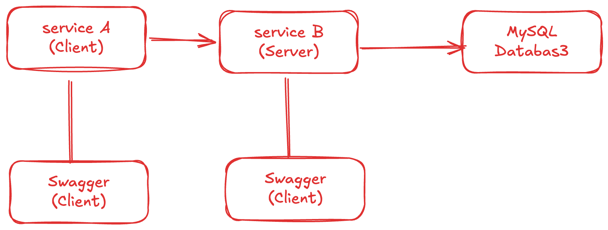
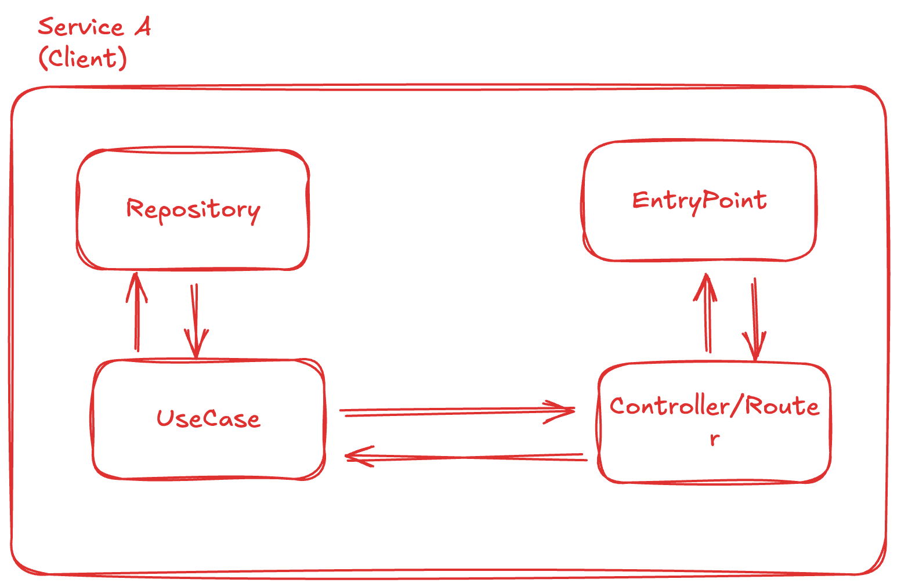
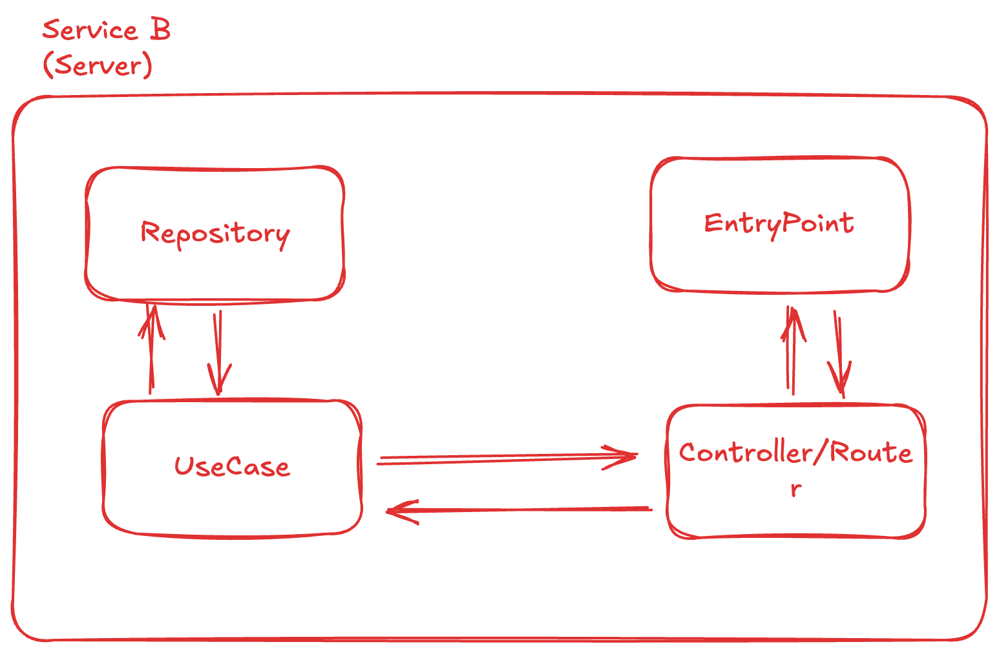
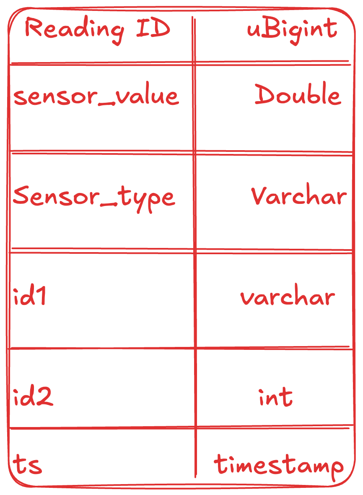

# Worlder Team Assignment

## TLDR

This project consists of 3 main components designed to test high-throughput data ingestion:

- **Service A (Client)**: A configurable data generator that spams sensor readings via gRPC
- **Service B (Server)**: A high-performance microservice with dual interfaces (gRPC + REST API)
- **MySQL Database**: Persistent storage for sensor readings

The primary objective is to design **Service B** to be as efficient as possible in receiving and processing large volumes of data from Service A.

## Architecture Overview


### Architecture of A

### Architecture of B

### Database Schema


## Service B (Server) - Architecture

Service B implements a **Clean Architecture** pattern with 3 distinct layers, listening on 2 different ports:

1. **Port 1**: gRPC server for high-throughput data ingestion from Service A
2. **Port 2**: REST API server using Echo framework for data management operations

### 🔄 Router/Controller Layer

**Purpose**: Request handling, validation, and response formatting

The router layer serves as the entry point for all incoming requests. Its responsibilities include:

- **Gentle Error Handling**: Provides user-friendly, concise, and clear error messages
- **Data Parsing**: Converts JSON payloads to Go structs
- **Input Validation**: Ensures data integrity before processing
- **Response Formatting**: Standardizes API responses

```go
// Example: Router handles parsing and validation
func (r *SensorRouter) CreateSensor(ctx echo.Context) error {
    var req model.SensorRequest
    if err := ctx.Bind(&req); err != nil {
        return ctx.JSON(400, ErrorResponse{"Invalid request format"})
    }
    // Delegate to usecase layer
    result, err := r.usecase.ProcessSensor(ctx.Request().Context(), &req)
    // ...
}
```

### 🧠 Usecase Layer

**Purpose**: Business logic and state management

The usecase layer contains all business logic and orchestrates data operations:

- **State Validation**: Compares incoming payloads with existing database records
- **Business Rules**: Implements domain-specific logic and constraints  
- **Multi-Query Coordination**: May execute multiple repository calls to gather sufficient data for validation
- **Transaction Management**: Ensures data consistency across operations

```go
// Example: Usecase coordinates multiple repository calls
func (u *SensorUsecase) ProcessSensorBatch(ctx context.Context, sensors []model.Sensor) error {
    // Check existing data
    existing, err := u.repo.GetByIDs(ctx, extractIDs(sensors))
    if err != nil {
        return err
    }
    
    // Apply business logic
    toInsert := u.validateAndFilter(sensors, existing)
    
    // Execute batch insert
    return u.repo.InsertBatch(ctx, toInsert)
}
```

### 🗃️ Repository Layer

**Purpose**: Data access abstraction and optimization

The repository layer provides a **protected interface** to the database:

- **Explicit Interface Design**: Only exposes intentionally designed data operations
- **Query Optimization**: Focuses on efficient and performant database interactions
- **Data Source Abstraction**: Shields upper layers from database implementation details
- **Intentional Operations**: Every query must be explicitly defined and purposeful

```go
type SensorRepository interface {
    InsertBatch(ctx context.Context, sensors []model.Sensor) error
    GetByTimeRange(ctx context.Context, start, end time.Time) ([]model.Sensor, error)
    GetByIDs(ctx context.Context, ids []IDCombination) ([]model.Sensor, error)
    // Only explicitly defined operations are available
}
```

## Database Service

### Schema Design

The database contains a single optimized table for sensor readings:

```sql
CREATE TABLE sensor_readings (
    id BIGINT AUTO_INCREMENT PRIMARY KEY,
    sensor_value DOUBLE NOT NULL,
    sensor_type VARCHAR(50) NOT NULL,
    id1 INT NOT NULL,
    id2 VARCHAR(50) NOT NULL,
    ts TIMESTAMP NOT NULL,
    
    INDEX idx_time (ts),
    INDEX idx_id_combination (id1, id2),
    INDEX idx_composite (id1, id2, ts)
);
```

### 🚀 Performance Optimization Strategy

**Hash Key Optimization** (Future Enhancement):
- **Current**: Separate `id1` and `id2` columns requiring composite indexing
- **Proposed**: Single `id_hash` column (INT64) combining `id1` and `id2`
- **Benefits**:
  - 50% reduction in index memory usage (1 column vs 2)
  - Faster lookups using INT64 operations
  - Simplified query patterns

```sql
-- Proposed optimization
ALTER TABLE sensor_readings 
ADD COLUMN id_hash BIGINT GENERATED ALWAYS AS (
    CAST(id1 AS UNSIGNED) << 32 | CRC32(id2)
) STORED;

CREATE INDEX idx_id_hash ON sensor_readings(id_hash);
```

## Service A (Client)

**Purpose**: Configurable load generator for performance testing

Service A is a **configurable data generator** that:
- Generates realistic sensor reading data
- Sends high-volume requests via gRPC to Service B  
- Supports configurable throughput rates and data patterns
- Measures and reports performance metrics

### Configuration Options
- **Rate Control**: Requests per second
- **Data Patterns**: Sensor types, ID ranges, value distributions
- **Concurrency**: Number of parallel gRPC connections
- **Duration**: Test run duration and data volume

## API Documentation

### gRPC Interface (High-Throughput Ingestion)
```protobuf
service SensorService {
    rpc SendSensorReading(SensorReading) returns (SensorResponse);
    rpc SendSensorBatch(SensorBatch) returns (BatchResponse);
}
```

### REST API (Data Management)
- `GET /sensor/time?from_time=...&to_time=...` - Query by time range
- `GET /sensor/ids?id1=0,1&id2=A,B` - Query by ID combinations  
- `GET /sensor/ids-time` - Query by IDs and time range
- `DELETE /sensor/delete/time` - Delete by time range
- `DELETE /sensor/delete/ids` - Delete by ID combinations
- `PUT /sensor/update/time` - Update by time range
- `PUT /sensor/update/ids` - Update by ID combinations

## Performance Considerations

### High-Throughput Design Patterns
1. **Batch Processing**: Group multiple sensor readings for efficient database operations
2. **Connection Pooling**: Optimize database connection usage
3. **Prepared Statements**: Reduce query parsing overhead
4. **Indexing Strategy**: Carefully designed indexes for common query patterns
5. **Memory Management**: Efficient struct design and garbage collection optimization

### Scalability Features
- **Horizontal Scaling**: Stateless design allows multiple Service B instances
- **Database Optimization**: Index-optimized queries and batch operations
- **Resource Management**: Configurable connection pools and timeouts
- **Monitoring**: Built-in metrics and performance monitoring

## Getting Started

### Prerequisites
- Go 1.19+
- MySQL 8.0+
- Docker (optional)

### Installation
```bash
# Clone the repository
git clone <repository-url>

# Start MySQL database
docker-compose up -d mysql

# Run Service B
cd service-b
go run main.go

# Run Service A (in another terminal)
cd service-a  
go run main.go
```

### Configuration
- Service B configuration: `config/config.yaml`
- Database connection: Environment variables or config file
- Service A load parameters: Command-line flags or config file

## Testing & Benchmarking

The system includes comprehensive testing tools for:
- **Load Testing**: Measure maximum throughput capacity
- **Latency Testing**: Response time analysis under various loads  
- **Data Integrity**: Ensure no data loss during high-throughput operations
- **Resource Usage**: Memory and CPU utilization monitoring

## Future Enhancements

1. **Database Optimization**: Implement hash-based ID indexing
2. **Caching Layer**: Add Redis for frequently accessed data
3. **Message Queue**: Implement async processing with RabbitMQ/Kafka
4. **Monitoring**: Add Prometheus metrics and Grafana dashboards
5. **Auto-scaling**: Kubernetes deployment with HPA

---

## Getting Started
before starting out you might want to run the basics
```bash
go mod vendor
go mod tidy
```
and then you can try running each instance by is selfs
### db
```bash
docker compose build --no-cache db-service
docker compose up -d db-service
```
### service b
```bash
go run b-service/main.go
```
you cen check the result in https://localhost:8080/swagger/swagger-ui/index.html
### service a
```bash
go run a-service/main.go
```
https://localhost:9000/swagger/swagger-ui/index.html

all API documentation will be available on swagger


## Running simmulation
if you want to run the simulation you can start by running. the script will create the backend and DB instance, then 1 client instance. the script will add additional instances;
```bash
docker compose up -d
chmod +x ./docker-scale-sript.sh
./docker-scale-sript.sh
```

finnaly after that i have built a CLI tool that will help you control all the clients behavior

```bash
chmod +x ./service-cli
./service-cli

--- output ---
./service-cli help
CLI tool for managing API endpoints across multiple ports

Usage:
  a-plane [command]

Available Commands:
  completion  Generate the autocompletion script for the specified shell
  frequency   Set frequency for all endpoints
  help        Help about any command
  start       Start all endpoints
  stats       Get aggregated stats from all endpoints
  stop        Stop all endpoints

Flags:
  -h, --help   help for a-plane

Use "a-plane [command] --help" for more information about a command.
```

with that in mind it, handling the clients shold be more managable.


The current result running in Macbook pro m3 chip

```bash
Running Status:
  Running: 10.000000/10.000000 endpoints

Overall RPS:
  Min: 1152.75, Max: 1197.89, Avg: 1157.32, Total: 11573.16

Total Failed:
  Min: 0.000000, Max: 0.000000, Avg: 0.000000, Total: 0.000000

Total Requests:
  Min: 22596.000000, Max: 23481.000000, Avg: 22684.500000, Total: 226845.000000

Total Sent:
  Min: 22596.000000, Max: 23481.000000, Avg: 22684.500000, Total: 226845.000000

Uptime (seconds):
  Min: 19.599930, Max: 19.601922, Avg: 19.600954, Total: 196.009538
```